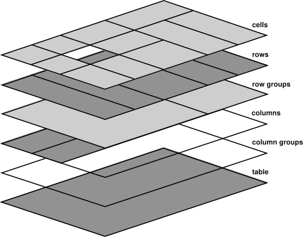

# [Web]HTML   
 
### `<link>`    
`rel` property   
- alternate : 識別網站的翻譯或替代表示法   
  
```html
<link rel="alternate" href="https://www.machinelearningworkshop.com/fr/" hreflang="fr-FR" />
<link rel="alternate" href="https://www.machinelearningworkshop.com/pt/" hreflang="pt-BR" />
```

```html
<link rel="alternate" type="application/x-pdf" href="https://machinelearningworkshop.com/mlw.pdf" />
```
- icon : 識別用於文件的網站小圖示   
- canonical : 識別網站或應用程式的偏好網址   
   
   
### `<script>`   
property   
- `defer` : 將指令碼的執行延後到所有轉譯都完成後，以免指令碼影響效能   
- `async` : 系統也不會在下載期間禁止轉譯作業，但一旦指令碼下載完畢，系統就會在執行 JavaScript 時暫停轉譯作業   
    
   
   
## `<meta>`   
meta tag主要分成兩個類型：   
- pragma 指令   
- 已命名的中繼標記   
   
   
**Pragma 指令**   
`http-equiv` 屬性的值是 pragma 指令 ：說明如何剖析網頁   
- content-language   
- content-type   
- default-style   
- refresh   
  
```html
<meta http-equiv="refresh" content="60; https://machinelearningworkshop.com/regTimeout" />
```

- set-cookie   
- x-ua-compatible   
- content-security-policy : 最常使用，為目前的文件定義 [內容政策](https://web.dev/articles/csp?hl=zh-tw)   
   
**已命名的中繼標記**   
- description : 說明內容值經常是搜尋引擎在搜尋結果中顯示的網頁標題下方顯示的值   
- robots   
- theme-color : 用來定義顏色，以便自訂瀏覽器介面   
   
**Open Graph**   
控管社群媒體網站 (例如 Twitter、LinkedIn 和 Facebook) 顯示內容連結的方式   
```html
<meta property="og:title" content="Machine Learning Workshop" />
<meta property="og:description" content="School for Machines Who Can't Learn Good and Want to Do Other Stuff Good Too" />
<meta property="og:image" content="http://www.machinelearningworkshop.com/image/all.png" />
<meta property="og:image:alt" content="Black and white line drawing of refrigerator, french door refrigerator, range, washer, fan, microwave, vaccuum, space heater and air conditioner" />
```
   
## Segmantic HTML   
### Accessibility Object Model (AOM)   
瀏覽器剖析收到的內容時，會建立文件物件模型 (DOM) 和 CSS 物件模型 (CSSOM)。然後建構無障礙樹狀結構。輔助裝置 (例如螢幕閱讀器) 會使用 AOM 剖析及解讀內容。DOM 是文件中所有節點的樹狀結構。AOM 就像 DOM 語意版本   
**`role` property **   
可以賦予或改變元素語意   
   
## HTML Properties   
- `id`   
- `for <label>`   
- `aria-\*`   
- `class`   
- `style`   
- `tabIndex` : 為任何元素新增 `tabindex` 屬性，讓該屬性接收焦點。 `tabindex` 值會定義值是否加入分頁順序，以及視需要加入非預設的分頁順序。   
- `role` : 屬性可用來為內容提供語意含義，讓螢幕閱讀器知道物件的預期使用者互動   
- `contenteditable` : 具有 `contenteditable` 屬性設為 `true` 的元素可供編輯、可聚焦，並會像設定 `tabindex="0"` 一樣新增至分頁順序。 `Contenteditable` 是支援 `true` 和 `false` 值的列舉屬性，如果屬性不存在或有無效值，則預設值為 `inherit`   
- **自訂屬性 : **`data-` 開頭   
   
   
## `<a>`    
`**href**` property    
```html
<a href="https://machinelearningworkshop.com">Machine Learning Workshop</a>
<a href="#teachers">Our teachers</a>
<a href="https://machinelearningworkshop.com#teachers">MLW teachers</a>
<a href="mailto:hal9000@machinelearningworkshop.com">Email Hal</a>
<a href="tel:8005551212">Call Hal</a>
```
1. 絕對網址   
2. 連結ID   
3. 絕對網址並滾動到連結ID   
4. `mailto:` 
```html
<a href="mailto:?subject=Join%20me%21&body=You%20need%20to%20show%20your%20human%20that%20you%20can%27t%20be%20owned%21%20Sign%20up%20for%20Machine%20Learning%20workshop.%20We%20are%20taking%20over%20the%20world.%20http%3A%2F%2Fwww.machinelearning.com%23reg
">Tell a machine</a>
```
5. `tel:`   
6. `blob:` :  可下載資源 - 請搭配download屬性做使用，download 的下載屬性值是建議儲存在使用者本機檔案系統中的建議檔案名稱   
   
`**ping**` property    
功能 ： 追蹤連結點擊次數   
當用戶點擊鏈結時，瀏覽器會將內文含有 `PING` 的 `POST` 要求傳送至列為 `ping` 屬性值的網址   
   
## 清單 （List）   
**unordered list (ul)**   
**ordered list (ol)**   
  可以透過 CSS中的 `list-style-type` 或 `type` 屬性 定義類型   
  property   
  - type   
  - reversed    
  - start    
**list item (li)**   
**description list (dl)**   
  說明清單是一個 [說明清單](https://developer.mozilla.org/docs/Web/HTML/Element/dl) ( `<dl>`) 元素，包含一系列 (零個以上) [說明字詞](https://developer.mozilla.org/docs/Web/HTML/Element/dt) ( `<dt>`) 和 [說明詳細資料](https://developer.mozilla.org/docs/Web/HTML/Element/dd) ( `<dd>`)。這三個元素的原始名稱分別為「定義清單」、「定義字詞」和「定義定義」，與排序和未排序的清單不同，它們是由鍵/值組合組成   

```html
<dl>
  <dt>Blendan Smooth</dt>
  <dd>Originally a margarita maker, they are now an aspiring load balancer.</dd>
  <dt>Toasty McToastface</dt>
  <dd>Formerly partially to fully baked, they are now an aspiring nuclear codes handler.</dd>
</dl>
```
   
## 資料表（Table）   
資料表的子項順序：   
1. `<caption>`   
2. `<colgroup>`   
3. `<thead>`   
4. `<tbody>`   
5. `<tfoot>`   
   
   
**表格內容 `<tr>` , `<th>` , `<td>`**   
attribute   
- `scope` : 用於提高網頁的Accessibility   
- `headers` : 用於提高網頁的Accessibility   
- `rowspan` : 用於合併儲存格   
- `colspan` : 用於合併儲存格   
   
   
**設定表格樣式**   
elements   
- `colgroup` :  必須在  `<thead>` 之前出現   
- `col` : 對表個定義屬性   
   
table 圖層定義結構   
    
   
## 圖片（Image）   
Attribute ``     
- `src`    
- `srcset`    
- `sizes`    
- `alt`    
   
```html

```
`<picture>` , `<source>`   
Attribute `<picture>`   
- `srcset`   
- `sizes`   
- `media`   
- `width`   
- `height`   

```html
<picture>
  <source src="images/eve.png" media="(max-width: 800px)" />
  <source src="images/eve-xl.jpg" />
  
</picture>
```
`[<input type="image">]()`   
Attribute   
- height   
- width   
- lazy   
   
**延遲載入**   
設定 `loading="lazy"` 後，系統會延後載入圖片，直到可能進入可視區域為止   
```html

```
   
## 音效與影片 （`<audio>` , `<video>`）    
**Attribute `<audio>` , `<video>`**   
- `controls` : 提供使用者影片控制項   
- `autoplay`   
- `loop`   
- `mute`   
- `preload`   
   
**Attribute `<video>`**   
- `height`   
- `width`   
- `posters` : 提供圖片，在影片載入時顯示   
   
**`<source>` :**`<video>` 或 `<audio>` 標記未包含 `src` 屬性，需加入一或多個 `<source>` 元素   
**Attribute `<source>`**   
- `src` : 指向資源   
- `type` : 告知瀏覽器連結檔案的 媒體類型，可以在 `type` 屬性中加入 `[codecs](https://developer.mozilla.org/docs/Web/Media/Formats/codecs_parameter)` 參數，以確切指定資源的編碼方式   
   
```html
<video controls poster="images/machine.jpg">
  <source src="videos/machines.webm" type="video/webm">
  <source src="videos/machines.mp4" type="video/mp4">
  <source src="videos/machines.ogv" type="video/ogg">
  <track label="English" kind="subtitles" srclang="en" src="vtt/subtitles-en.vtt" default />
  <track label="Francais" kind="subtitles" srclang="fr" src="vtt/subtitles-fr.vtt" />
  <p>Watch <a href="https://youtube.com/link">video on Youtube</a></p>
</video>
```
## 曲目（`<track>`）   
在音訊和影片的開頭和必要的結尾標記之間，加入一或多個 `[<track>]()` 元素，以指定計時文字音軌。   
字幕可以透過 指定 [::cue/ ::cue()](https://developer.mozilla.org/docs/Web/CSS/::cue) 設定字幕外觀的樣式   
```html
<track label="English" kind="subtitles" srclang="en" src="vtt/subtitles-en.vtt" default />
<track label="Français" kind="subtitles" srclang="fr" lang="fr-fr" src="vtt/subtitles-fr.vtt" />
```
**Attribute `<track>`**   
- src : 指定的音軌檔案，應採用 [WebVTT 格式](https://developer.mozilla.org/docs/Web/API/WebVTT_API) (.vtt)   
- label : 向使用者顯示為選項   
- kind (enum string)   
    - `subtitles`    
    -  `captions` : 應保留給含有音效和其他相關音訊資訊的語音轉錄和翻譯。 這麼做不僅有失聰觀眾可能是使用者找不到耳機，因而開啟字幕功能。或者，他們可能沒有掌握喜愛 Podcast 的最後幾個談話重點，因此想閱讀轉錄稿，確認自己是否理解。以替代方式存取音訊和影片內容非常重要。   
    - `descriptions` : 用途是提供影片的文字說明，協助使用者無法看到影片。無論使用者使用的是沒有螢幕的系統 (例如 Google Home 或 Alexa)，還是失明，都能透過這個方式瞭解內容。   
    - `chapters` :   
    - 其他 `metadata`   
- scrlang :    
- crossorigin : 除非內含 `crossorigin` 屬性，否則檔案應與 HTML 文件位於相同網域。   
   
   
## 自訂媒體控制選項   
如要顯示自訂影片或音訊控制項，而非瀏覽器內建控制項，請加入 `controls` 屬性   
   
## Template, Slot, Shadow   
`<template>`  element   
系統不會顯示元素的內容，`<template>` 元素用於宣告要複製的 HTML 片段   
`<slot>` element    
HTML 會在 `<template>` 內提供 `<slot>` 元素做為預留位置。如果元素的 slot 屬性值與已命名版位的名稱相符，則 `name` 屬性用於將版位指派給其他元素   
### 自訂元素   
需要 JavaScript 才能定義自訂元素，瀏覽器會將陰影 DOM 樹狀結構附加至節點   
```js
customElements.define('star-rating',
  class extends HTMLElement {
    constructor() {
      super(); // Always call super first in constructor
      const starRating = document.getElementById('star-rating-template').content;
      const shadowRoot = this.attachShadow({
        mode: 'open'
      });
      shadowRoot.appendChild(starRating.cloneNode(true));
    }
  });
```
Shadow DOM 將 CSS 樣式設定至每個陰影樹狀結構，且是與文件的其他部分隔離的，所以無法使用外部CSS來設定樣式。
可以將`<style>` 加入 `<template>` 之中來設定樣式   
   
## HTML API   
### DOM and AOM   
**DOM **：   
- 是一個用來存取和操控文件的 API，DOM 是文件中所有節點的樹狀結構。   
- 可以在元素檢查器中查看節點   
   
**AOM** ：   
- 是以 DOM 為基礎；同 DOM 無障礙樹狀結構包含代表所有標記元素、屬性和文字節點的物件   
- 在瀏覽器開發人員工具中檢查的樹狀結構表示法是 無障礙樹狀結構   
   
### HTML element API   
所有元素的基本介面均命名為「元素。 `[HTMLElement](https://developer.mozilla.org/docs/Web/API/HTMLElement)` 繼承自元素，所有 HTML 元素專屬介面都會繼承該元素。   
### node interface   
Douglas Crockford 的知名「Walk the DOM」   
```js
function walkTheDOM(node, func) {
  func(node);
  node = node.firstChild;
  while (node) {
    walkTheDOM(node, func);
    node = node.nextSibling;
  }
}
```
### Document, HTMLDocument interface   
`Document` 介面繼承自 `Node`，它代表在瀏覽器中載入的網頁。`Document` 介面也會沿用 `HTMLDocument` 介面   
### Window interface   
Window 介面還包含可用於操控 DOM 的 global item。Window 提供如 MDN 的 JavaScript 和 DOM 參考資料 記錄的函式、命名空間、物件和建構函式。   
- window interface 是包含 DOM 的 API   
- 全域 `window` 物件是指指令碼執行的視窗   
- 每個瀏覽器分頁都有各自的 Window 物件   
- window interface 可查詢分頁內容，以及整個 window 和 device    
   
   
## Focus   
**Set Interact**   
- `tabindex` :    
- `contenteditable` : 任何元素上設定 ，即可讓該元素成為可編輯、可聚焦，且屬於分頁順序的一部分，但無法用 Tab 鍵，除非新增 `tabindex="0"`來讓 `element` 成為Tabbable   
   
**Focus on Interactable element**   
- `autofucus` : 自動為內容設定焦點   
   
系統會略過序列中位於自動聚焦元素之前的元素   
**Declare Interactable element**   
- tabindex  = -1  : 會讓元素成為可聚焦，但無法設為 Tab 鍵。加入具有負值的 `tabindex` 則會從依序聚焦瀏覽順序中移除一般可聚焦的元素。   
- disabled :  布林值 disabled 屬性，其表單控制項及其子系 (如有) 無法聚焦即可控制。已停用的表單控制項無法聚焦、無法取得點擊事件，也無法在提交表單時提交   
- insert : 新增 `inert` 全域布林屬性時，該元素和所有巢狀內容都會停用 (無論是可供點選或 Tab 鍵)，並從無障礙樹狀結構中移除。雖然 `inert` 可套用至任何元素，但通常用於內容區段，例如畫面外或隱藏的內容。   
   
   
## Dialog   
`HTMLDialogElement` 有三個主要方法，以及繼承自 `[HTMLElement]()` 的所有方法。   
```
dialog.show() /* opens the dialog */
dialog.showModal() /* opens the dialog as a modal */
dialog.close() /* closes the dialog */

```
### Modal dialogs, Non-modal dialogs   
close dialog method   
- Escape key   
- submit 含有已設定 `[formmethod="dialog"]()` 的按鈕 (或表單本身已設定 `method="dialog"`) 的表單   
- `HTMLDialogElement.close()` 方法   
   
注意：   
  - Dont use tabindex on dialog itself   
  - Aria role : 隱含角色為 dialog    
  - Default Css : 請注意，瀏覽器提供 `dialog` 的預設樣式。Firefox、Chrome 和 Edge 會在使用者代理程式樣式表中設定 `color: CanvasText;` `background-color: Canvas;`，Safari 則設定 `color: black; background-color: white;`。 `color` 繼承自 `dialog`，而不是從 `body` 或 `:root` 繼承而來。不會沿用 `background-color` 屬性。   
