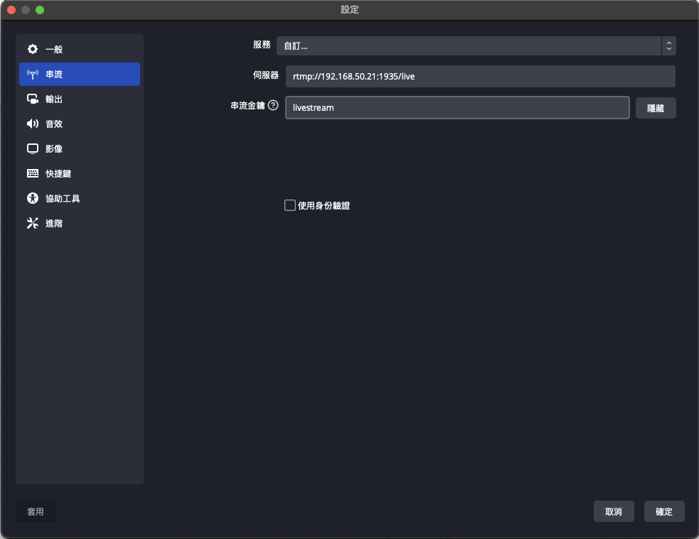

# [Stream]Simple Realtime Server 簡單開發筆記   

# Live Streaming (RTMP)   
## Run SRS with Docker    
docker-compose.yml   
```yaml
version: '3.8'
services:
  srs:
    image: ossrs/srs:5
    ports:
      - "1935:1935"
      - "1985:1985"
      - "8080:8080"
      - "8000:8000/udp"
      - "10080:10080/udp"
    tty: true
    stdin_open: true
    command: "./objs/srs -c conf/rtmp2rtc.conf"
```
### 使用 ffmpeg 推流    
```bash
ffmpeg -re -i ./doc/source.flv -c copy -f flv rtmp://localhost/live/livestream
```
- `./doc/source.flv`：被推流檔案路徑   
- `rtmp://localhost/live/livestream` ：目標推流位置   
   
### 使用 obs 推流    
    
- 伺服器：目標推流位置   
- 串流金鑰：任意   
   
### 從 SRS 拉流   
`rtmp://<your-srs-host>/<target-publish-path>`   
若使用 obs 推流，拉流時拉流位置為**`伺服器`位置 + 串流金鑰**   
  以上方圖片為例 在拉流時 路徑就為 `rtmp://192.168.50.21:1935/live/livestream`   
   
